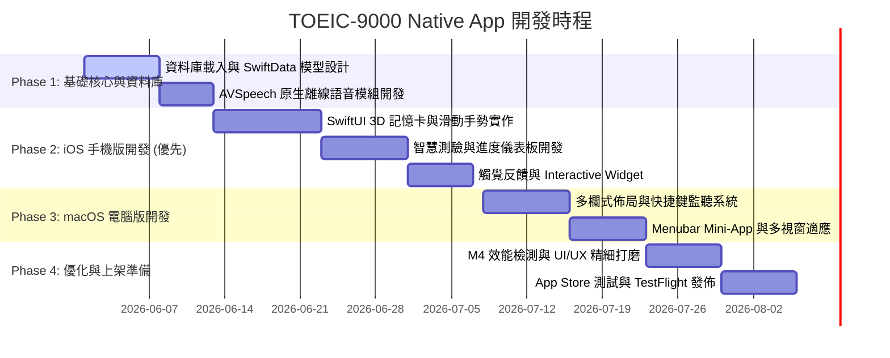

# TOEIC-9000 App 版本設計與開發規劃書

本規劃書旨在說明如何將 **TOEIC-9000** 移植為支援跨 Apple 生態系（iOS 與 macOS）的原生應用程式。我們將採用 Apple 官方推薦的現代聲明式框架 **SwiftUI** 與資料管理框架 **SwiftData**，在極致的操作體驗下，發揮 Apple Silicon（特別是 M4 晶片）的效能與硬體加速優勢。

---

## 🛠️ 核心技術選型 (Technology Stack)

為了在 iOS 及 macOS 上達到最頂級的流暢度與操作體驗，我們放棄跨平台套殼網頁技術，選擇全 native 方案：

| 模組 / 層級 | 選用技術 | 優勢與考量 |
| :--- | :--- | :--- |
| **開發框架** | **SwiftUI (Multiplatform)** | 單一 Swift 專案同時編譯出原生 iOS 與 macOS 執行檔，佈局自動適應不同螢幕，並具備流暢的 Spring 彈簧動畫效果。 |
| **資料持久化** | **SwiftData (iOS 17+ / macOS 14+)** | 替代 CoreData 的現代資料管理框架。使用 Swift 語法，整合 `@Model` 宣告，便於管理 9000 單字的學習狀態、收藏紀錄、連續學習天數與統計數據。 |
| **發音系統** | **AVFoundation (AVSpeechSynthesizer)** | 呼叫 Apple 系統原生高品質 TTS 引擎（如 Siri 聲音、Alex），無須任何外部網路請求即可離線進行清晰、無延遲的單字發音。 |
| **圖示系統** | **SF Symbols 5 / 6** | Apple 系統級向量圖標，支援多色階、階層著色，並與系統字型（San Francisco）完美對齊。 |
| **觸覺反饋 (iOS)** | **CoreHaptics / UIImpactFeedbackGenerator** | 標示已掌握或答題對錯時提供細緻的微震動，顯著增強物理操作手感。 |
| **硬體優化 (macOS)** | **M4 Metal 加速與 Native arm64 編譯** | 專為 M4 晶片的統一記憶體架構與神經網路引擎優化，確保 9000 個單字在資料庫查詢與動態卡片 3D 渲染時達到 120Hz ProMotion 滿幀運作。 |

---

## 📱 手機版本 (Apple iOS) 操作體驗優化

手機端著重於**單手操作**、**直覺手勢**與**零碎時間的快速記憶**：

### 1. 手勢導向的卡片記憶 (Swipe-to-Learn)
- **卡片翻轉**：點擊字卡，透過 3D 卡片翻轉動畫揭曉釋義。
- **滑動標記**：
  - 向**右**大力滑動：標記為「已掌握」，並觸發「輕快成功」的物理震動回饋。
  - 向**左**大力滑動：標記為「需要複習 (Again)」，並觸發「警告」震動。
  - 向上滑動：直接「收藏單字」至星號字庫。

### 2. 精緻的單手導向佈局
- 導覽列與操作按鈕皆集中在螢幕下半部（觸手可及區域），避免頻繁點擊左上角返回。
- 支援 iOS 系統的 **Interactive Widgets（互動式小工具）**，使用者不用打開 App 即可在主畫面或鎖定畫面直接點擊發音或標記背誦今日單字。

### 3. 動態觸覺反饋 (Haptic Feedback)
- 多選測驗中，答對會觸發輕彈反饋（Light Impact），答錯則會觸發雙擊警告（UINotificationFeedbackGeneratorError）。

---

## 💻 電腦版本 (macOS) 效率體驗優化

電腦端著重於**高頻率的工作流**、**多工並行**與**鍵盤快捷鍵**的支援：

### 1. 全鍵盤無滑鼠操作 (Power-User Shortcuts)
為了讓使用者能極速瀏覽單字，系統設計了完整的快捷鍵綁定：
- `Space` (空白鍵)：翻轉字卡。
- `Arrow Right` (右方向鍵) 或 `D`：已掌握（Mastered）。
- `Arrow Left` (左方向鍵) 或 `A`：需要複習（Again）。
- `Arrow Up` (上方向鍵) 或 `S`：收藏單字（Star）。
- `Command + F`：快速聚焦到字庫搜尋框。
- `1` / `2` / `3` / `4`：在多選測驗中快速選擇對應的選項。

### 2. 視窗適應與多工支援
- **靈活的三欄式佈局**：寬螢幕下使用 Sidebar 導覽，中欄顯示單字清單，右欄顯示單字詳情，實現大螢幕的高效資訊呈現。
- **Menubar Mini-App (選單列小工具)**：支援將 TOEIC-9000 縮小至 macOS 選單列（Menubar）。使用者在工作或寫程式時，可隨時點擊滑出「今日單字小卡」，不佔用工作視窗。
- **支援 M4 ProMotion 120Hz**：在滾動 9000 筆單字時，實現絲滑的滾動體驗。

---

## 🏛️ 模組與資料結構設計 (Architecture & Data Schema)

### 1. 資料庫設計 (SwiftData Models)
```swift
import Foundation
import SwiftData

@Model
final class WordProgress {
    @Attribute(.unique) var word: String     // 英文單字 (如: coordinate)
    var rank: Int                             // 頻率排名 (1 至 9000)
    var level: Int                            // 級別 (1 至 4)
    var isStarred: Boolean = false            // 是否收藏
    var isMastered: Boolean = false           // 是否已掌握
    var lastReviewed: Date?                   // 最後複習時間
    var reviewCount: Int = 0                  // 複習次數
    
    init(word: String, rank: Int, level: Int) {
        self.word = word
        self.rank = rank
        self.level = level
    }
}

@Model
final class UserStreak {
    var lastStudyDate: String = ""            // 格式: YYYY-MM-DD
    var currentStreak: Int = 0                // 連續學習天數
    var dailyGoal: Int = 20                   // 每日目標單字數
}
```

### 2. 核心元件模組
- `WordDatabase`：負責將內嵌的 9000 單字庫載入 SwiftData 進行初始設定。
- `SpeechSynthesizer`：AVFoundation 發音封裝，管理播放暫停及語音參數設定。
- `DashboardView`：iOS 環形進度圖表與 macOS 折線統計圖。
- `FlashcardView`：管理 3D 卡片翻轉的 Y-Axis 旋轉動畫與滑動手勢。
- `QuizEngine`：處理答題計分、混淆選項生成與拼寫重組邏輯。

---

## 📅 分階段開發時程規劃 (Phased Roadmap)



---

## 📝 驗證與測試計畫

### 1. 自動化測試 (Unit & UI Tests)
- **資料庫整合測試**：驗證 9000 筆單字初始匯入後，SwiftData 的查詢效率與正確性（特別是在過濾 level 與 模糊搜尋時，耗時需小於 10 毫秒）。
- **測驗引擎測試**：驗證隨機混淆選項生成算法，確保不會有重複選項或空值。

### 2. 實機效能驗證
- **iOS 實機測試**：在 iPhone 15/16 Pro 系列上驗證 A17/A18 晶片於 120Hz ProMotion 螢幕下的滑動手勢是否能保持滿幀。
- **macOS M4 實機測試**：驗證在多工作業與分螢幕佈局下，CPU/GPU 資源佔用率應趨近於零，且冷啟動時間小於 100 毫秒。
